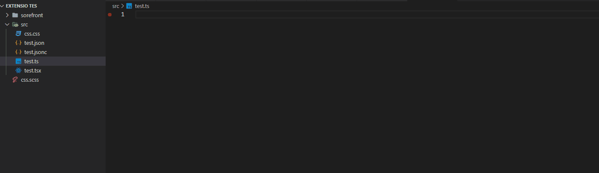

# Ferramentas do Marlon Passos 

Essa extensão foi desenvolvida por Marlon Passos, e é um acumulador de ferramentas que me ajudam no dia a dia.

## Snippets

---
- **Atalho:** ``efin``
- **Descrição:** exporta função com interface com nome
- **Tipo de Arquivo:** ``*.ts``, ``*.tsx``

---
- **Atalho:** ``efsn``
- **Descrição:** exporta função simples com nome
- **Tipo de Arquivo:** ``*.ts``, ``*.js``, ``*.tsx``, ``*.jsx`` 
```tsx
export function test() {

}

```
---
- **Atalho:** ``edfsn``
- **Descrição:** exporta default função simples com nome
- **Arquivo:** ``teste.ts`` 
```tsx
export default function test() {

}

```
---
- **Atalho:** ``fs``
- **Descrição:** função simples
- **Arquivo:** ``teste.ts`` 
```tsx
function () {

}

```


## 📚 Rereferia 
[Veja a lista com todas os snippets disponíveis.]("doc/snippets.md")